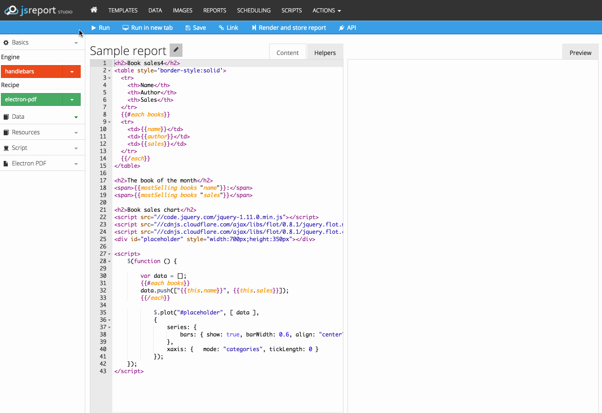

# jsreport-electron-pdf
[](https://npmjs.com/package/jsreport-electron-pdf)
[](http://opensource.org/licenses/MIT)
[](https://travis-ci.org/bjrmatos/jsreport-electron-pdf)

> **jsreport recipe which renders pdf from html using electron**



Adds recipe `electron-pdf` to jsreport, which render pdf from html using electron.

`electron-pdf` recipe is capable of rendering any html and javascript you provide. This means you can also use external javascript libraries or canvas to print visual charts.

## jsreport-core

If you use `jsreport-core`, you can apply this extension manually and [pass configuration](#configuration) to it directly:

```js
var jsreport = require('jsreport-core')();
jsreport.use(require('jsreport-electron-pdf')({ strategy: 'electron-server' }));
```

## Configuration

Use `electron` key in the standard [jsreport config](https://github.com/jsreport/jsreport/blob/master/config.md) file.

Available options:

```js
electron: {
  /* use rather dedicated process for every generation, 
    dedicated-process strategy is quite slower but can solve some bugs 
    with corporate proxy, set to 'electron-server' for maximum performance. 

    possible values: 'dedicated-process' or 'electron-server', defaults to 'dedicated-process' */
  strategy: 'electron-server',
  /* number of allocated electron processes (when using electron-server strategy) */
  numberOfWorkers: 2,
  /* timeout in ms for pdf generation, when the timeout is reached, the conversion is cancelled */
  timeout: 5000,
  /* set to true to allow requests using the file protocol (file:///). defaults to false */
  allowLocalFilesAccess: false
}
```

## Settings

`electron-pdf` recipe uses [electron's printToPDF feature](http://electron.atom.io/docs/v0.35.0/api/web-contents/#webcontents-printtopdf-options-callback) to generate PDF from a web page, so basically most options are the same as electron's `printoToPDF` options.

Available settings for pdf generation:

- `marginsType` Number - specify the type of margins to use in PDF.
  - `0` - default
  - `1` - none
  - `2` - minimum
- `landscape` Boolean - `true` for landscape, `false` for portrait.
- `format` String - predefined page sizes.
  - `A4`
  - `A3`
  - `Legal`
  - `Letter`
  - `Tabloid` 
- `printBackground` Boolean - whether to print CSS backgrounds or not.
- `width` Number - width (`px`) of the web page (`BrowserWindow`) that would be used to generate the PDF.
- `height` Number - height (`px`) of the web page (`BrowserWindow`) that would be used to generate the PDF.
- `printDelay` Number - delay between rendering a page and printing into pdf, this is useful when printing animated content like charts, or you can use `waitForJS` option.
- `blockJavaScript` Boolean - whether to disable javascript execution in page or not.
- `waitForJS` Boolean - if it is set to `true` the PDF generation will wait until you set `window.JSREPORT_READY_TO_START` to true in your page.

## Page breaks

Css contains styles like `page-break-before` you can use to specify html page breaks. This can be used as well with `electron-pdf to specify page breaks inside pdf files.

```html
<h1>Hello from Page 1</h1>

<div style='page-break-before: always;'></div>

<h1>Hello from Page 2</h1>

<div style="page-break-before: always;"></div>

<h1>Hello from Page 3</h1>
```

## Headers and footers

Attach a header and footer to PDF is not currently supported :(, unlike `phantomjs`, `electron` does not provide a way to attach a header/footer to the final PDF.

## Printing triggers

You may need to postpone pdf printing until some javascript async tasks are processed. If this is your case set the `waitForJS: true` option in the API or `Wait for printing trigger` in the studio menu. Then the printing won't start until you set `window.JSREPORT_READY_TO_START=true` inside your template's javascript.

```html
...
<script>
    // do some calculations or something async
    setTimeout(function() {
        window.JSREPORT_READY_TO_START = true; // this will start the pdf printing
    }, 500);
    ...
</script>
```

## Twitter Bootstrap
Using a responsive css framework for printing pdf may not be the best idea. However it still works. Only thing you need to keep in mind is that output pdf typically won't look the same as html because bootstrap includes different printing styles under `@media print`.


